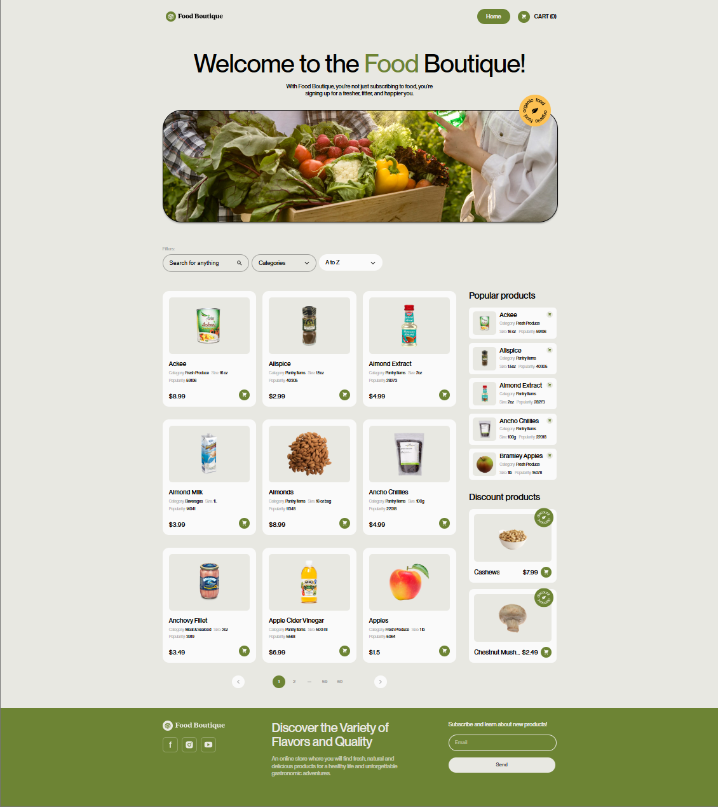

# Food Boutique

Food Boutique is a responsive React e-commerce application for browsing grocery
products, filtering the catalog, managing a shopping cart, and placing a demo
order. The project focuses on a clean product discovery flow, cart persistence,
API-driven content, and a polished storefront experience suitable for a frontend
portfolio.

## Live Demo

[Live demo link](https://summermoved0n.github.io/project-FoodBoutique/)

## GitHub Repository

[GitHub repository link](https://github.com/summermoved0n)

## Main Features

- Product catalog loaded from the Food Boutique API
- Search by keyword and category
- Sorting/filtering by alphabet, price, and popularity
- Product details modal with add/remove cart actions
- Popular products and discounted products sections
- Persistent cart using `localStorage`
- Cart quantity controls and total price calculation
- Email-based checkout form with order success modal
- Newsletter subscription form
- Privacy Policy and Terms of Service modals
- GitHub Pages deployment configuration

## Tech Stack

- React 18
- React Router DOM
- Create React App / React Scripts
- JavaScript
- CSS
- Styled Components
- Material UI dependencies
- React Hot Toast
- React Paginate
- React Icons
- Food Boutique REST API

## Screenshots

Add screenshots before sharing this project with recruiters:

- Home page / hero and product catalog
- Product details modal
- Cart page
- Mobile layout

Example:

### Home Page




## Installation

1. Clone the repository:

```bash
git clone https://github.com/summermoved0n/project-FoodBoutique
```

2. Navigate to the project folder:

```bash
cd project-FoodBoutique
```

3. Install dependencies:

```bash
npm install
```

4. Start the development server:

```bash
npm start
```

5. Open the app in your browser:

```text
http://localhost:3000
```

## Available Scripts

```bash
npm start
```

Runs the app in development mode.

```bash
npm run build
```

Creates an optimized production build in the `build` folder.

```bash
npm test
```

Runs the test watcher.

```bash
npm run lint:js
```

Runs ESLint for JavaScript and JSX files in `src`.

## Project Structure

```text
project-FoodBoutique/
  public/                 Static public assets and HTML entry point
  src/
    components/           Reusable UI components
    helpers/              API service, cart context, shared helpers, base styles
    images/               Local images and SVG sprite
    pages/                Route-level pages
    index.js              React entry point and router setup
    index.css             Global CSS imports
  assets/                 README and deployment images
  package.json            Dependencies and project scripts
```

## Key Implementation Details

- The application uses React Router for page navigation between the home page
  and cart page.
- Cart state is provided through React Context and persisted in `localStorage`
  so users do not lose their cart after refreshing the page.
- Product data, categories, popular products, discounted products, newsletter
  subscription, and order submission are handled through a dedicated API service
  class.
- Product cards and modals share the same cart actions to keep the shopping flow
  consistent.
- Pagination is handled on the client after fetching the product list from the
  API.

## What I Learned

- Building a multi-page React storefront with shared layout and route-level
  pages
- Managing cross-component cart state with Context
- Persisting UI state with `localStorage`
- Working with REST API endpoints for catalog, subscription, and order flows
- Creating reusable product, modal, filter, and cart components
- Preparing a React project for GitHub Pages deployment

## Future Improvements

- Add mobile-first responsive styles for all primary layouts
- Improve accessibility for custom dropdowns, product cards, icon buttons, and
  modals
- Add user-facing error states for failed API requests
- Wait for successful order submission before showing the success modal and
  clearing the cart
- Replace the dual cart/order arrays with a single normalized cart state
- Add tests for cart logic, checkout behavior, filters, and API failure states
- Move API base URL into a configuration file or environment variable
- Add product image lazy loading and request pagination to improve performance
- Update project metadata in `package.json` to match the portfolio project

## Author

Created by **DmytroShulzhenko**.

- GitHub: [your-username](https://github.com/summermoved0n)
- LinkedIn:
  [your-linkedin-profile](https://www.linkedin.com/in/dmytro-shulzhenko-software-engineer/)
